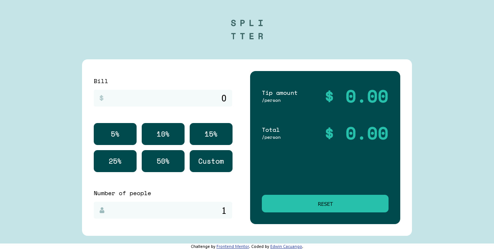

# Frontend Mentor - Tip calculator app solution

This is a solution to the [Tip calculator app challenge on Frontend Mentor](https://www.frontendmentor.io/challenges/tip-calculator-app-ugJNGbJUX). Frontend Mentor challenges help you improve your coding skills by building realistic projects.

## Table of contents

- [Overview](#overview)
  - [The challenge](#the-challenge)
  - [Screenshot](#screenshot)
  - [Links](#links)
- [My process](#my-process)
  - [Built with](#built-with)
  - [What I learned](#what-i-learned)
  - [Continued development](#continued-development)
  - [Useful resources](#useful-resources)
- [Author](#author)
- [Acknowledgments](#acknowledgments)

## Overview

### The challenge

Users should be able to:

- View the optimal layout for the app depending on their device's screen size
- See hover states for all interactive elements on the page
- Calculate the correct tip and total cost of the bill per person

### Screenshot



### Links

- Solution URL: [Frontend Mentor site](https://www.frontendmentor.io/solutions/tip-calculator-using-react-0DJymiOlq)
- Live Site URL: [Click here!](https://reverent-saha-d7fba4.netlify.app/)

## My process

### Built with

- Semantic HTML5 markup
- Flexbox
- Mobile-first workflow
- [React](https://reactjs.org/) - JS library


### What I learned

Use this section to recap over some of your major learnings while working through this project. Writing these out and providing code samples of areas you want to highlight is a great way to reinforce your own knowledge.

To see how you can add code snippets, see below:

```html
<h1>Some HTML code I'm proud of</h1>
```
```css
.proud-of-this-css {
  color: papayawhip;
}
```
```js
const proudOfThisFunc = () => {
  console.log('🎉')
}
```

If you want more help with writing markdown, we'd recommend checking out [The Markdown Guide](https://www.markdownguide.org/) to learn more.

**Note: Delete this note and the content within this section and replace with your own learnings.**

### Continued development

I want to create more clean apps, with less folders or files...or with a better structure, to easy lecture. 

### Useful resources

- [Insert an icon inside a text field, HTML Input](https://desarrolloweb.com/faq/html-con-javascript) - This helped me to fit an icon within inputs element
- [How to delete buttons from numeric inputs](https://es.stackoverflow.com/questions/20484/c%C3%B3mo-eliminar-los-botones-de-un-input-number/20486) - This is an answer in stack overflow, wich help me to hide increment butons of desktop view. That was a default client style for inputs type number. 


## Author

- Frontend Mentor - [@EdwinCacuango](https://www.frontendmentor.io/profile/EdwinCacuango)
- Twitter - [@edwincacuango](https://www.twitter.com/edwincacuango)


## Acknowledgments

This is where you can give a hat tip to anyone who helped you out on this project. Perhaps you worked in a team or got some inspiration from someone else's solution. This is the perfect place to give them some credit.

**Note: Delete this note and edit this section's content as necessary. If you completed this challenge by yourself, feel free to delete this section entirely.**
